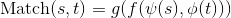

<div align="center">

<br>
<br>
<p><b>Awesome Neural Models for Semantic Match</b></p>
</div>
<br>
<p align="center">
<sub>A collection of papers maintained by MatchZoo Team.</sub>
<br>
<sub>Checkout our open source toolkit <a href="https://github.com/faneshion/MatchZoo">MatchZoo</a> for more information!</sub>
</p>
<br>

Text matching is a core component in many natural language processing tasks, where many task can be viewed as a matching between two texts input.

<div align="center">

</div>

Where **s** and **t** are source text input and target text input, respectively. The **psi** and **phi** are representation function for input **s** and **t**, respectively. The **f** is the interaction function, and **g** is the aggregation function. More detailed explaination about this formula can be found on [A Deep Look into Neural Ranking Models for Information Retrieval](https://arxiv.org/abs/1903.06902). The representative matching tasks are as follows:

<table>
<tr>
<th width=30%, bgcolor=#999999 >Tasks</th> 
<th width=20%, bgcolor=#999999>Source Text</th>
<th width="20%", bgcolor=#999999>Target Text</th>
</tr>
<tr>
<td align="center", bgcolor=#eeeeee> Ad-hoc Information Retrieval </td>
<td align="center", bgcolor=#eeeeee> query </td>
<td align="center", bgcolor=#eeeeee> document (title/content) </td>
</tr>
<tr>
<td align="center", bgcolor=#eeeeee> Community Question Answer </td>
<td align="center", bgcolor=#eeeeee> question </td>
<td align="center", bgcolor=#eeeeee> question/answer </td>
</tr>
<tr>
<td align="center", bgcolor=#eeeeee> Paraphrase Indentification </td>
<td align="center", bgcolor=#eeeeee> string 1 </td>
<td align="center", bgcolor=#eeeeee> string 2 </td>
</tr>
<tr>
<td align="center", bgcolor=#eeeeee> Natural Language Inference </td>
<td align="center", bgcolor=#eeeeee> premise </td>
<td align="center", bgcolor=#eeeeee> hypothesis </td>
</tr>
</table>


### Ad-hoc Information Retrieval

---

**Information retrieval** (**IR**) is the activity of obtaining information system resources relevant to an information need from a collection. Searches can be based on full-text or other content-based indexing.  Here, the **Ad-hoc information retrieval** refer in particular to text-based retrieval where documents in the collection remain relative static and new queries are submitted to the system continually (cited from the [survey](https://arxiv.org/pdf/1903.06902.pdf)).

the number of queries is huge. Some benchmark datasets are listed in the following,

* [**Robust04**](https://trec.nist.gov/data/t13_robust.html) is a small news dataset which contains about 0.5 million documents in total. The queries are collected from TREC Robust Track 2004. There are 250 queries in total.

* [**Cluebweb09**](https://trec.nist.gov/data/webmain.html) is a large Web collection which contains about 34 million documents in total. The queries are accumulated from TREC Web Tracks 2009, 2010, and 2011. There are 150 queries in total.

* [**Gov2**](https://trec.nist.gov/data/terabyte.html) is a large Web collection where the pages are crawled from .gov. It consists of 25 million documents in total. The queries are accumulated over TREC Terabyte Tracks 2004, 2005, and 2006. There are 150 queries in total.

* [**MSMARCO Passage Reranking**](http://www.msmarco.org/dataset.aspx) provides a large number of information question-style queries from Bing's search logs. There passages are annotated by humans with relevant/non-relevant labels. There are 8,841822 documents in total. There are 808,731queries, 6,980 queries and 48,598 queries for train, validation and test, respectively.

Neural information retrieval (NeuIR) models include:

**DSSM** [[code]](https://github.com/NTMC-Community/MatchZoo/blob/master/matchzoo/models/dssm.py) [[pdf]](https://www.microsoft.com/en-us/research/wp-content/uploads/2016/02/cikm2013_DSSM_fullversion.pdf) [[tutorial]](https://www.microsoft.com/en-us/research/wp-content/uploads/2017/07/dl-summer-school-2017.-Jianfeng-Gao.v2.pdf) 


Learning Deep Structured Semantic Models for Web Search using Clickthrough Data. *CIKM 2013*.

> DSSM uses a DNN to map high-dimensional sparse text features into low-dimensional dense features in a semantic space. The first hidden layer, with 30k units, accomplish word hashing. The word-hashed features are then projected through multiple layers of non-linear projections. The final layer's neural activities in this DNN from the feature in the semantic spae.

**CDSSM**  [[code]](https://github.com/NTMC-Community/MatchZoo/blob/master/matchzoo/models/cdssm.py) [[pdf]](https://www.microsoft.com/en-us/research/wp-content/uploads/2016/02/www2014_cdssm_p07.pdf) 


Learning Semantic Representations Using Convolutional Neural Networks for Web Search. *WWW 2014*.

A Latent Semantic Model with Convolutional-Pooling Structure for Information Retrieval. *CIKM 2014*.

> CDSSM contains a word hashing layer that transforms each word into a letter tri-gram input representation, a convolutional layer to extract local contextual features, a max-pooling layer to form a global feature vector, and a final semantic layer to represent the high-level semantic feature vector of the input word sequence.

**DRMM**  [[code]](https://github.com/NTMC-Community/MatchZoo/blob/master/matchzoo/models/drmm.py) [[pdf]](http://www.bigdatalab.ac.cn/~gjf/papers/2016/CIKM2016a_guo.pdf) 


A Deep Relevance Matching Model for Ad-hoc Retrieval. *DRMM 2016*.

> DRMM employs a joint deep architecture at the query term level over the local interactions between query and document terms for relevance matching. It first build local interactions between each pair of terms from a query and a document based on term embeddings. For each query term, it then transform the variable-length local interactions into a fixed-length matching histogram. Then, a feed forward matching network learns the hierarchical matching pattern and produce a matching score for each query term. Finally, the overall matching score is generated by aggregating the scores from each qury term with a term gating network.

**KNRM**  [[code]](https://github.com/NTMC-Community/MatchZoo/blob/master/matchzoo/models/knrm.py) [[pdf]](https://arxiv.org/pdf/1706.06613.pdf) 


End-to-End Neural Ad-hoc Ranking with Kernel Pooling. *SIGIR 2017*

> KNRM uses a translation matrix that models word-level similarities via word embeddings, a kernel-pooling technique that uses kernels (i.e., RBF kernel) to extract multi-level soft match features, and a learning-to-rank layer that combines those features into the final ranking score.

**CONV-KNRM**  [[code]](https://github.com/NTMC-Community/MatchZoo/blob/master/matchzoo/models/conv_knrm.py) [[pdf]](http://www.cs.cmu.edu/~zhuyund/papers/WSDM_2018_Dai.pdf) 


Convolutional Neural Networks for Soft-Matching N-Grams in Ad-hoc Search. *WSDM 2018*

> CONV-KNRM uses convolutiona neural networks to represent n-grams of various lengths and soft-matches them in a unified embedding space. The n-gram soft matches are then utilized by the kernel pooling and learning-to-rank layers to generate the final ranking score.

**Duet** [[code]](https://github.com/NTMC-Community/MatchZoo/blob/master/matchzoo/models/duet.py) [[pdf]](https://www.microsoft.com/en-us/research/wp-content/uploads/2016/10/wwwfp0192-mitra.pdf) 


Learning to Match using Local and Distributed Representations of Text for Web Search. *WWW 2017*

> Duet is composed of two separate DNNS that model query-document relevance using local and distributed representations, respectively. The two DNNS, refered to henceforth as the *local model* and the *distributed model*. The local model takes an interaction matrix of query and document terms as input, whereas the distributed model learns embeddings of the query and document text before matching.

**Co-PACRR**  [[code]]() [[pdf]](https://arxiv.org/pdf/1706.10192.pdf) 


Co-PACRR: A Context-Aware Neural IR Model for Ad-hoc Retrieval. *WSDM 2018*.

> Co-PACRR takes tow matrices as input, namely $sim_{|q|\times |d|}$ and $querysim_{|d|}$. Then, several 2D convolutional kernels are first applied to the similarity matrices, and max pooling is applied to the filters. Following this, $n_s$-max pooling captures the strongest $n_s$ signals, and the context similarity corresponding to each term is also appended. Finally, the query term's normalized IDFs are appended, and a feed forward network is applied to obtain the final relevance score.

**LSTM-RNN**  [[code not ready]]() [[pdf]](https://www.microsoft.com/en-us/research/wp-content/uploads/2017/02/LSTM_DSSM_IEEE_TASLP.pdf) 


Deep Sentence Embsedding Using Long Short-Term Memory Networks: Analysis and Application to Information Retrieval. *TASLP 2016*.

> The LSTM-RNN utilizes RNN for sentence embedding to find a dense and low dimensional semantic representation by sequentially and recurrently processing each word in a sentence and mapping it into a low dimensional vector. Firstly, each word is coded as a one-hot vector, and then converts to a letter tori-gram vector through a hashing layer. Then, these word representations are projected into the RNN sequentially to produce the final sentence representation.

**DRMM_TKS** [[code]](https://github.com/NTMC-Community/MatchZoo/blob/master/matchzoo/models/drmm_tks.py) [[pdf]](https://link.springer.com/chapter/10.1007/978-3-030-01012-6_2) 


A Deep Relevance Matching Model for Ad-hoc Retrieval (*A variation of DRMM). *CCIR 2018*.

> DRMM_TKS is an variant version of DRMM, where the matching histogram layer is replaced by a sorted top-k pooling layer. Specifically, each query term is interacted with all the document terms to produce the query term-level interaction vector. Then, a sorted top-k pooling layer is applied on this vector to obtain the fixed length interaction vector. All the other components remains fixed with original DRMM.

**DeepRank**  [[code]]() [[pdf]](https://arxiv.org/pdf/1710.05649.pdf) 


DeepRank: A New Deep Architecture for Relevance Ranking in Information Retrieval. *CIKM 2017*

> In the DeepRank model, firstly, a detection strategy is designed to extract the relevant contexts. ŒThen, a measure network is applied to determine the local relevances by utilizing a convolutional neural network (CNN) or two-dimensional gated recurrent units (2D-GRU). Finally, an aggregation network with sequential integration and term gating mechanism is used to produce a global relevance score.

**HiNT**  [[code]]() [[pdf]](https://arxiv.org/pdf/1805.05737.pdf) 


Modeling Diverse Relevance Patterns in Ad-hoc Retrieval. *SIGIR 2018*.

> HiNT is a data-driven method which allows relevance signals at different granularities to compete with each other for final relevance assessment. It consists of two stacked components, namely local matching layer and global decision layer. The local matching layer focuses on producing a set of local relevance signals by modleing the semantic matching between query and each passage of a document. The global decision layer accumulates local signals into different granularities and allows them to compete with each other to decide the final relevance score.


### Paraphrase Identification

---

**Paraphrase Identification** is an task to determine whether two sentences have the same meaning, a problem considered a touchstone of natural language understanding.

Some benchmark datasets are listed in the following,

- [**MSRP**](https://www.microsoft.com/en-us/download/details.aspx?id=52398&from=http%3A%2F%2Fresearch.microsoft.com%2Fen-us%2Fdownloads%2F607d14d9-20cd-47e3-85bc-a2f65cd28042%2Fdefault.aspx) is short for Microsoft Research Paraphrase Corpus. It contains 5,800 pairs of sentences which have been extracted from news sources on the web, along with human annotations indicating whether each pair captures a paraphrase/semantic equivalence relationship.
- [**Quora Question Pairs**](https://data.quora.com/First-Quora-Dataset-Release-Question-Pairs) is a task released by Quora which aims to identify duplicate questions. It consists of over 400,000 pairs of questions on Quora, and each question pair is annotated with a binary value indicating whether the two questions are paraphrase of each other.

A list of neural matching models for paraphrase identification models are as follows,

**ARC-I** [[code]](https://github.com/NTMC-Community/MatchZoo/blob/master/matchzoo/models/arci.py) [[pdf]](https://arxiv.org/pdf/1503.03244.pdf) 


Convolutional Neural Network Architectures for Matching Natural Language Sentences. *NIPS 2014*.

> ARC-I takes a 1D convolution neural network to produce the representation of each sentence input, and then compares the representation for the two sentences with a multi-layer perceptron (MLP). 

**ARC-II** [[code]](https://github.com/NTMC-Community/MatchZoo/blob/master/matchzoo/models/arcii.py) [[pdf]](https://arxiv.org/pdf/1503.03244.pdf) 


Convolutional Neural Network Architectures for Matching Natural Language Sentences. *NIPS 2014*.

> ARC-II is built directly on the interaction space between two sentences. It has the desireable property of letting two sentences meet before their own high-level representations mature, while still retaining the space for the individual development of abstraction of each sentence.

**MV-LSTM** [[code]](https://github.com/NTMC-Community/MatchZoo/blob/master/matchzoo/models/mvlstm.py) [[pdf]](https://arxiv.org/pdf/1511.08277.pdf) 


A Deep Architecture for Semantic Matching with Multiple Positional Sentence Representations. *AAAI 2016*.

> MV-LSTM matches two sentences with multiple positional sentence representations. Specifically, each positional sentence representation is a sentence representation at this position, generated by a bidirectional long short term memory (Bi-LSTM). The matching score is finally produced by aggregating interactions between these different positional sentence representations, through $k-$Max pooling and a multi-layer perceptron.

**MatchPyramid** [[code]](https://github.com/NTMC-Community/MatchZoo/blob/master/matchzoo/models/match_pyramid.py) [[pdf]](https://arxiv.org/pdf/1602.06359.pdf) 


Text Matching as Image Recognition. *AAAI 2016*.

> MatchPyramid model text matching as the problem of image recognition. Firstly, a matching matrix whose entries represent the similarities between words is constructed and viewed as an image. Then a convolutional neural network is utilized to capture rich matching patterns in a layer-by-layer way.

**Match-SRNN**  [[code]](https://github.com/NTMC-Community/MatchZoo/blob/master/matchzoo/models/matchsrnn.py) [[pdf]](https://arxiv.org/pdf/1604.04378.pdf) 


Match-SRNN: Modeling the Recursive Matching Structure with Spatial RNN. *IJCAI 2016*.

> Match-SRNN view the generation of the global interaction between two texts as a recursive process: i.e. the interaction of two texts at each position is a composition of the interactions between their prefixes as well as the word level interaction at the recurrent position. Firstly, a tensor is constructed to capture the word level interactions. Then a spatial RNN is applied to integrate the local interactions recursively, with importance determined by four types of gates. Finally, the matching score is calculated based on the global interaction.

**MultiGranCNN** [[code]]() [[pdf]](https://aclanthology.info/pdf/P/P15/P15-1007.pdf) 


MultiGranCNN: An Architecture for General Matching of Text Chunks on Multiple Levels of Granularity. *ACL 2015*.

> MultiGranCNN firstly utilize gpCNN to learn representations for generalized phrases where a generalized phrase is a general term for subsequences of all granularities: words, short phrases, long phrases and the sentence itself. Then, one of three match feature models (DIRECTSIM, CONCAT or INDIRECTSIM) produces an $s_1 \times s_2$ match feature matrix which is further reduced to a fixed size matrix by dynamic 2D pooing. Finally, the mfCNN extracts interaction features of increasing complexity from the basic interaction features computed by the match feature model. Finally, the output of the last block of mfCNN is the input to an MLP that computes the match score.

**ABCNN** [[code]]() [[pdf]](https://arxiv.org/pdf/1512.05193.pdf) 


ABCNN: Attention-Based Convolutional Neural Network for Modeling Sentence Pairs. *ACL 2016*.

> ABCNN refers to Attention Based Convolutional Neural Network, which applies an attention mechanism on the Bi-CNN. The Bi-CNN is a siamese architecture which consists of two weight sharing CNNs.

**MwAN** [[code]]() [[pdf]](https://www.ijcai.org/proceedings/2018/0613.pdf) 


Multiway Attention Networks for Modeling Sentences Pairs. *IJCAI 2018*.

> MwAN is built on the matching-aggregation framework. Given two sentences,  a bidirectional RNN to is applied to obtain contextual word representation of words in two sentences based on the word embeddings. Then it takes four attention functions to match two sentences at the word level. Next, it aggregates the matching information from multiway attention functions with two steps with two bi-directional RNN. Finally, it applies the attention-pooling to the matching information for a fix-length vector and feed it into a multilayer perceptron for the final decision.


### Community Question Answer

---

**Community Question Answer** is to automatically search for relevant answers among many responses provided for a given question (Answer Selection), and search for relevant questions to reuse their existing answers (Question Retrieval).

Some benchmark datasets are listed in the following,

- [**WikiQA**](https://www.microsoft.com/en-us/download/details.aspx?id=52419) is a publicly available set of question and sentence pairs, collected and annotated for research on open-domain question answering by Microsoft Research.
- [**TRECQA**](https://trec.nist.gov/data/qa.html) dataset is created by [Wang et. al.](https://www.aclweb.org/anthology/D07-1003) from TREC QA track 8-13 data, with candidate answers automatically selected from each question’s document pool using a combination of overlapping non-stop word counts and pattern matching. This data set is one of the most widely used benchmarks for [answer sentence selection](https://aclweb.org/aclwiki/Question_Answering_(State_of_the_art)).
- [**SemEval-2015 Task 3**](http://alt.qcri.org/semeval2015/task3/) consists of two sub-tasks. In Subtask A, given a question (short title + extended description), and several community answers, classify each of the answer as definitely relevance (good), potentially useful (potential), or bad or irrelevant (bad, dialog, non-english other). In Subtask B, given a YES/NO question (short title + extended description), and a list of community answers, decide whether the global answer to the question should be yes, no, or unsure.
- [**SemEval-2016 Task 3**](http://alt.qcri.org/semeval2016/task3/) consists two sub-tasks, namely *Question-Comment Similarity* and *Question-Question Similarity*. In the *Question-Comment Similarity* task, given a question from a question-comment thread, rank the comments according to their relevance with respect to the question. In *Question-Question Similarity* task, given the new question, rerank all similar questions retrieved by a search engine.
- [**SemEval-2017 Task 3**](http://alt.qcri.org/semeval2017/task3/) contains two sub-tasks, namely *Question Similarity* and *Relevance Classification*. Given the new question and a set of related questions from the collection, the *Question Similarity* task is to rank the similar questions according to their similarity to the original question. While the *Relevance Classification* is to rank the answer posts according to their relevance with respect to the question based on a question-answer thread.

Representative neural matching models for CQA include:

**aNMM** [[code]](https://github.com/NTMC-Community/MatchZoo/blob/master/matchzoo/models/anmm.py) [[pdf]](https://arxiv.org/pdf/1801.01641.pdf) 


aNMM: Ranking Short Answer Texts with Attention-Based Neural Matching Model. *CIKM 2016*.

> The aNMM referes to attention-based Neural Matching Model. In an abstract level, it contains three steps: 1) it construct QA matching matrix for each question and answer pair with pre-trained word embeddings. 2) it then employ a deep neural network with value-shared weighting scheme in the first lyaer, and fully connected layer in the rest to learn hierarchical abstraction of the semantic matching between question and answer terms. 3) finally, it employs a question attention network to learn question term importance and produce the final ranking score.

**MCAN** [[code]]() [[pdf]](https://arxiv.org/pdf/1806.00778.pdf) 


Multi-Cast Attention Networks for Retrieval-based Question Answering and Response Prediction. *KDD 2018*.

> MCAN takes attention as a form of feature augmentation, i.e, casted attention. It performs a serious of soft attention operations, each time casting a scalar feature upon the inner word embeddings. The key idea is to provide a real-valued hint (feature) to a subsequent encoder layer and is targeted at improving the representation learning process.

**MIX** [[code]]() [[pdf]](https://sites.ualberta.ca/~dniu/Homepage/Publications_files/hchen-kdd18.pdf) 


MIX: Multi-Channel Information Crossing for Text Matching. *KDD 2018*.

> MIX is a multi-channel convolutional neural network model for text matching in a production environment, with additional attention mechanisms on sentences and semantic features. MIX compares text snippets at varied granularities to form a serious of multi-channel similarity matrices, which are then crossed with another set of carefully designed attention matrices to expose the rich structure of sentences to deep neural network.

**HAR** [[code]]() [[pdf]](http://dmkd.cs.vt.edu/papers/WWW19.pdf) 


HAR: A Hierarchical Attention Retrieval Model for Healthcare Question Answering. *WWW 2019*.

> HAR uses a deep attention mechanism at word, sentence, and document levels, for efficient retrieval for both factoid and non-factoid queries, on documents of varied lengths. Specifically, the word-level cross-attention allows the model to identify words that might be most relevant for a query, and the hierarchical attention at sentence and document levels allows it to do effective retrieval on both long and short documents.

### Natural Language Inference

---

**Natural Language Inference** is the task of determining whether a "hypothesis" is true (entailment), false (contradiction), or undetermined (neutral) given a "premise".

It is worth to note that most models designed for Paraphrase Identification task can also be applied on NLI tasks, such as MatchPyramid, Match-SRNN, MV-LSTM, MwAN, and MultiGranCNN.

Some benchmark datasets are listed in the following,

- [**SNLI**](https://nlp.stanford.edu/projects/snli/) is the short of Stanford Natural Language Inference, which has 570k human annotated sentence pairs. Thre premise data is draw from the captions of the Flickr30k corpus, and the hypothesis data is manually composed.
- [**MultiNLI**](https://www.nyu.edu/projects/bowman/multinli/) is short of Multi-Genre NLI, which has 433k sentence pairs, whose collection process and task detail are modeled closely to SNLI. The premise data is collected from maximally broad range of genre of American English such as non-fiction genres (SLATE, OUP, GOVERNMENT, VERBATIM, TRAVEL), spoken genres (TELEPHONE, FACE-TO-FACE), less formal written genres (FICTION, LETTERS) and a specialized one for 9/11.

Representative neural matching models for NLI include:

**Match-LSTM** [[code]](https://github.com/NTMC-Community/MatchZoo/blob/master/matchzoo/contrib/models/match_lstm.py) [[pdf]](http://www.aclweb.org/anthology/N16-1170) 


Learning Natural Language Inference with LSTM. *NAACL 2016*.

> Match-LSTM uses an LSTM to perform word-by-word matching of the hypothesis with the premise. The LSTM sequentially processes the hypothesis, and at each position, it tries to match the current word in the hypothesis with an attention-weighted representation of the premise.

**Decomposable** [[code]](https://github.com/HsiaoYetGun/Decomposable-Attention) [[pdf]](https://arxiv.org/abs/1606.01933) 


A Decomposable Attention Model for Natural Language Inference. *EMNLP 2016.Google*

> Decomposable propose a simple neural architecture for natural language inference. It uses attention to decompose the problem into subproblems that can be solved separately, thus making it trivially parallelizable. 

**BiMPM** [[code]](https://github.com/NTMC-Community/MatchZoo/blob/master/matchzoo/contrib/models/bimpm.py) [[pdf]](https://arxiv.org/pdf/1702.03814.pdf) 


Bilateral Multi-Perspective Matching for Natural Language Sentences. *IJCAI 2017*.

> Given two sentences P and Q, BiMPM first encodes them with a BiLSTM encoder. Next, it matches the two encoded sentences in two directions P against Q and Q against P. In each matching direction, each time step of one sentence is matched against all timesteps of the other sentence from multiple perspectives. Then, another BiLSTM layer is utilized to aggregate the matching results into a fixed-length matching vector. Finally, based on the matching vector, a decision is made through a fully connected layer. 
>

**ESIM** [[code]]() [[pdf]](https://arxiv.org/pdf/1609.06038.pdf) 


Enhanced LSTM for Natural Language Inference. *ACL 2017*.

> ESIM explicitly encodes parsing information with recursive networks in both local inference modeling and inference composition. In a high-level view, the model consists of four components, namely input encoding, local inference modeling, inference composition, and prediction. The input encoding takes BiLSTM as well as tree-LSTM on the inputs (i.e., premise and hypothesis). Then, two separate local inference modeling components are built on these two encoding outputs. Next, it performs the composition sequentially or in its parse context using BiLSTM and tree-LSTM, respectively. Finally, the multilayer perceptron is applied to predict the final output.

**DIIN** [[code]]() [[pdf]](https://arxiv.org/pdf/1709.04348.pdf) 


Natural Lanuguage Inference Over Interaction Space. *ICLR 2018*.

> DIIN refers to Densely Interactive Inference Network which consists of five stacked layers, namely embedding layer, encoding layer, interaction layer, feature extraction layer, and output layer. The embedding layer concatenate word embedding, characture feature and syntactical features. Then, the encoding layer is a two-layer highway network, with an self-attention layer in the follows. Next, the interaction layer constructs an interaction matrix based on previous layer's outputs. And, the feature extraction layer utilizes [DenseNet](https://arxiv.org/abs/1608.06993) as convolutional feature extractor. Finally, a linear layer is applied to classify final flattened feature representation to predefined classes.
>

**SAN**  [[code]]() [[pdf]](https://arxiv.org/pdf/1804.07888.pdf) 


Stochastic Answer Networks for Natural Language Inference. *ACL 2018*.

> SAN refers to Stochastic Answer Network which consists of four stacked layers, namely *Lexicon Encoding Layer*, *Contextual Encoding Layer*, *Memory Layer*, and *Answer Module*. 

**HCRN**  [[code]]() [[pdf]](https://www.ijcai.org/proceedings/2018/0615.pdf) 


Hermitian Co-Attention Networks for Text Matching in Asymmetrical Domains. *IJCAI 2018*.

> HCRN refers to Hermitian Co-Attention Recurrent Network, namely *Input Encoding*, *Hermitian Co-Attention*, *Hermitian Intra-Attention*, and *Aggregation and Prediction*. 

**AF-DMN**  [[code]]() [[pdf]](https://www.ijcai.org/proceedings/2018/0561.pdf) 


Attention-Fused Deep Matching Network for Natural Language Inference. *IJCAI 2018*.

> AF-DMN takes two sentences as input and iteratively learns the attention-aware representations for each side by multi-level interactions. Moreover, AF-DMN has a self- attention mechanism to fully exploit local context information within each sentence.

### Healthcheck

```python
pip3 install -r requirements.txt
python3 healthcheck.py
```